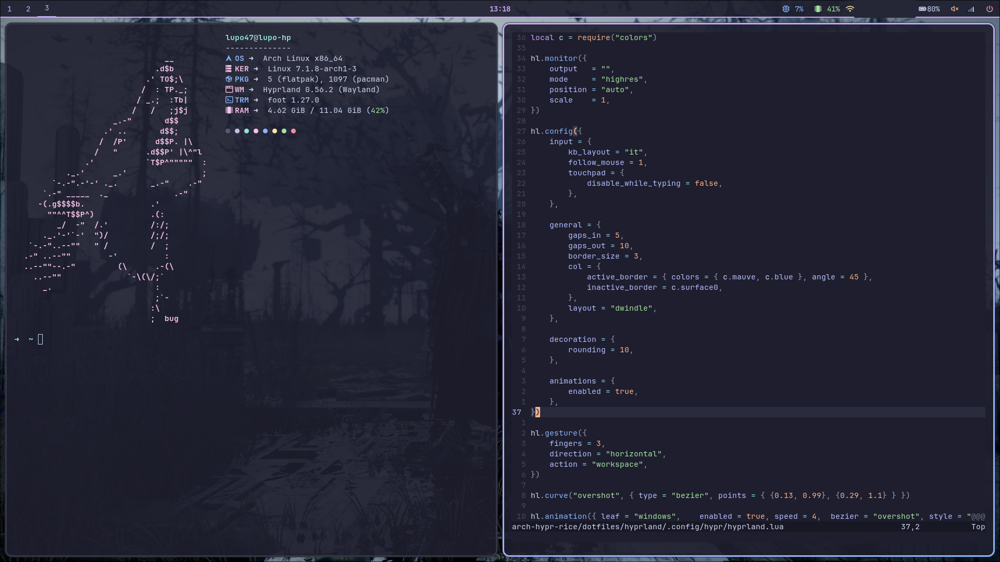
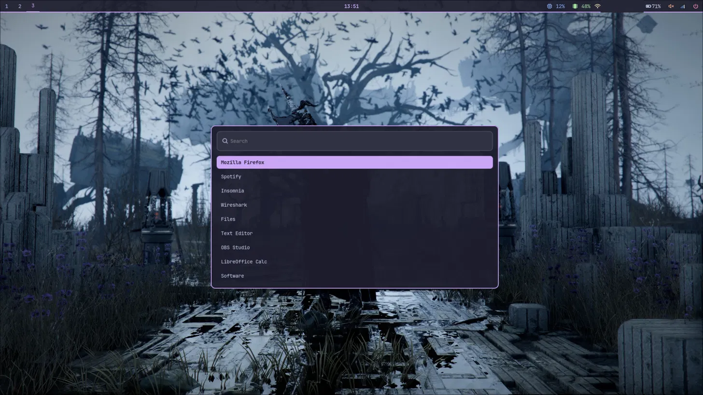
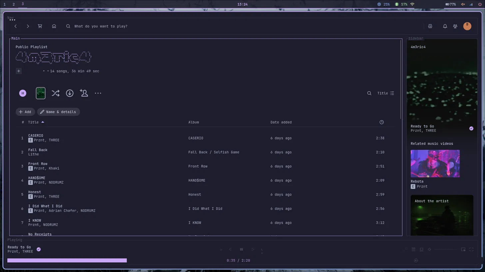

# Arch Linux · Hyprland · Catppuccin Mocha

Automated Arch Linux setup built around **Hyprland** (new Lua configuration format, 0.55+) and themed with **Catppuccin Mocha**. Dotfiles are deployed with **GNU Stow** so edits stay live through symlinks, and an optional module layers a **Cyber-Security & CTF toolchain** on top, isolated in its own Python virtual environment.


---

## Showcase







---

## What's inside

- **WM:** Hyprland with dwindle layout, gradient borders (mauve→blue), rounded corners and slide/overshoot animations
- **Bar:** Waybar — workspaces, clock, CPU/RAM (click → `btop`), network, battery, audio, power menu
- **Terminal:** Foot (`--server`/`footclient`), JetBrainsMono Nerd Font, 90% opacity
- **Launcher:** Wofi · **Logout/power:** `wlogout`
- **Editor:** Neovim on Lazy.nvim + Treesitter, Catppuccin Mocha, `Space` leader
- **Shell:** Zsh + Oh My Zsh (`zsh-autosuggestions`, `zsh-syntax-highlighting`)
- **Extras:** Fastfetch (custom wolf ASCII), Spotify + Spicetify, optional CTF suite

---

## Prerequisites

This is **not** a full-disk installer. It expects an existing base Arch install with:

- A working internet connection
- A non-root user with `sudo` privileges
- `git` available (`sudo pacman -S git`) to clone the repo

The scripts handle everything above that layer — desktop, drivers, dotfiles and tooling.

---

## Installation

```bash
git clone https://github.com/tonyscar47/arch-hypr-rice.git
cd arch-hypr-rice
chmod +x install.sh install-cyber.sh
```

### 1. Full desktop rice

```bash
./install.sh
```

At the end you'll be prompted `[y/N]` to also install the Cyber-Security & CTF suite.

### 2. Standalone Cyber & CTF setup

Run this on its own if you only want the CTF tools, Docker/Wireshark permissions and the Python venv on an already-configured system:

```bash
./install-cyber.sh
```

### What `install.sh` does to your system

Worth knowing before you run it, since it touches system config:

- Enables `Color` + `ILoveCandy` and sets `ParallelDownloads = 10` in `pacman.conf`
- Refreshes the mirrorlist with `reflector` (top 20 HTTPS mirrors by rate)
- Installs the desktop suite, base dev tools, and `yay` (AUR helper)
- Deploys dotfiles with `stow -t "$HOME"`
- Installs Oh My Zsh and sets Zsh as the default shell
- Enables `NetworkManager`, sets default MIME handlers (Zathura for PDF, LibreOffice for docs)

Everything is logged to `install_progress.log`.

---

## Cyber-Security & CTF Suite

Security tooling is kept in a separate script to keep the base system clean and to avoid Python PEP 668 conflicts with the system package manager.

| Category | Tools |
| --- | --- |
| Network analysis | `nmap`, `wireshark-qt`, `tshark`, `tcpdump`, `openbsd-netcat`, `socat` |
| Reverse engineering & exploitation | `gdb`, `gef-bin` (AUR), `ghidra`, `radare2`, `binwalk`, `strace`, `ltrace` |
| Web & password cracking | `burpsuite` (AUR), `sqlmap`, `ngrok` (AUR), `john`, `hashcat` |
| Containers | `docker`, `docker-compose` (auto-adds you to the `docker` and `wireshark` groups) |

### Python virtual environment (`~/.venvs/ctf`)

An isolated venv is created with: `requests`, `scapy`, `pwntools`, `pycryptodome`, `sympy`, `z3-solver`, `ropper`.

### CTF shell aliases

| Command | Action |
| --- | --- |
| `ctf-on` | Activate the CTF venv (`source ~/.venvs/ctf/bin/activate`) |
| `ctf-off` | Deactivate the venv |
| `serve` | Local HTTP server on port 8000 |
| `ncl <port>` | Netcat listener (`nc -lvnp <port>`) |
| `b64d` | Base64 decode |
| `rot13` | ROT13 decode |
| `checksec` | Binary security checks (`pwn checksec`) |

> After install, run `source ~/.zshrc` (or re-login) so the aliases and Docker/Wireshark group changes take effect.

---

## Keyboard Shortcuts

Main modifier is **SUPER** (Windows / Command key).

| Keybinding | Action |
| --- | --- |
| `SUPER + Enter` | Open terminal (`footclient`) |
| `SUPER + D` | Application launcher (Wofi) |
| `SUPER + Q` | Close active window |
| `SUPER + F` | Toggle fullscreen |
| `SUPER + Space` | Toggle floating mode |
| `SUPER + Arrow Keys` | Move focus between windows |
| `SUPER + [1-9]` | Switch to workspace 1-9 |
| `SUPER + Shift + [1-9]` | Move active window to workspace 1-9 |
| `SUPER + Left Click (hold)` | Move window freely |
| `SUPER + Right Click (hold)` | Resize window freely |
| `Print` | Area screenshot to clipboard (`grim` + `slurp`) |
| `Shift + Print` | Fullscreen screenshot to `~/Pictures/` |
| `Volume / Brightness keys` | Adjust audio (`wpctl`) and backlight (`brightnessctl`) |

Keyboard layout is set to `it` in `hyprland.lua` — change `kb_layout` there if you use a different one.

---

## Repository Structure

```
arch-hypr-rice/
├── dotfiles/
│   ├── fastfetch/      # Fastfetch layout & wolf ASCII art
│   ├── foot/           # Foot terminal config (Catppuccin Mocha, 0.9 alpha)
│   ├── hyprland/       # Lua-based Hyprland configuration (0.55+)
│   ├── nvim/           # Neovim configuration (Lazy.nvim, Treesitter)
│   ├── waybar/         # Status bar JSON layout & CSS style
│   ├── wofi/           # Wofi launcher (Catppuccin Mocha style & config)
│   └── zsh/            # Zsh configuration & Oh My Zsh settings
├── install.sh          # Desktop environment installer
├── install-cyber.sh    # Security & CTF suite installer
└── README.md
```

### Configuration details

- **Hyprland** (`dotfiles/hyprland/.config/hypr/`): native Lua format. `colors.lua` holds the Catppuccin palette table; `hyprland.lua` handles keybindings, monitors, decoration and autostart.
- **Waybar** (`dotfiles/waybar/.config/waybar/`): `config` (JSON) + `style.css`. CPU/RAM click opens `btop` in Foot; the power button triggers `wlogout`.
- **Wofi** (`dotfiles/wofi/.config/wofi/`): `style.css` + `config`, Catppuccin Mocha with a mauve accent matching Waybar, fuzzy matching enabled.
- **Foot** (`dotfiles/foot/.config/foot/foot.ini`): JetBrainsMono Nerd Font, Catppuccin Mocha, 90% opacity, Zsh as the shell.
- **Neovim** (`dotfiles/nvim/.config/nvim/init.lua`): Lazy.nvim, Treesitter, `Space` leader, a handful of quality-of-life keymaps.
- **Fastfetch** (`dotfiles/fastfetch/.config/fastfetch/`): hardware/OS metrics next to the `wolf.txt` ASCII art.

---

## Spotify & Spicetify

On a fresh install, Spotify has to be opened once before themes can be applied:

1. Open **Spotify** from the launcher, then close it.
2. Run:
   ```bash
   spicetify backup apply
   curl -fsSL https://raw.githubusercontent.com/spicetify/marketplace/main/resources/install.sh | sh
   ```
3. Restart Spotify to load the Spicetify Marketplace.

---

## Troubleshooting

- **Logs:** check `install_progress.log` (desktop) or `install_cyber.log` (security tools) for exact errors.
- **Pacman cache errors** (mirror timeouts / partial downloads):
  ```bash
  sudo pacman -Scc
  sudo pacman -Syu
  ```
- **Network applet** won't launch from the tray — use the TUI: `nmtui`
- **Docker / Wireshark permissions:** if capture or Docker still needs `sudo`, log out and back in so the group changes apply.

---

## License

Distributed under the **MIT License**. See [`LICENSE`](LICENSE) for details.